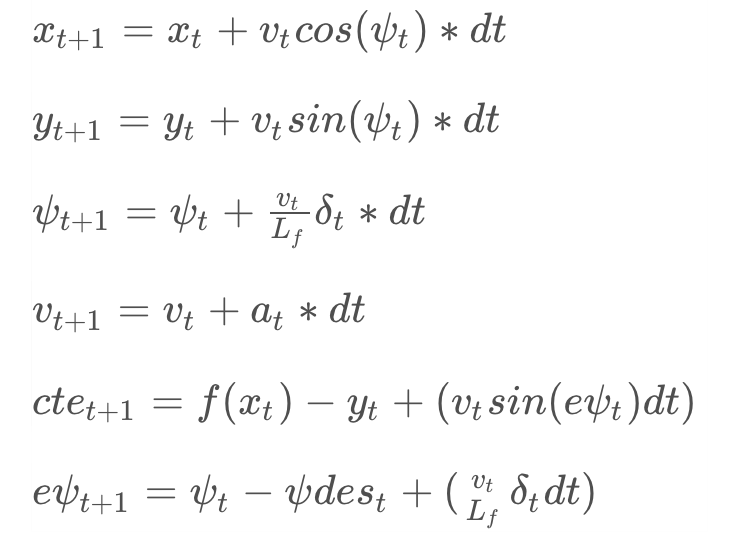

# MPC Controller Project
[](http://www.udacity.com/drive)

This repository contains my solution to the Udacity Self-Driving Car NanoDegree MPC Controller Project.

The repository contains the following notable files:

* `src/MPC.cpp` : Implementation of MPC controller for the project
* `src/main.cpp` : Implementation of MPC controller `main()` function for the project
* this readme file

## Basic Build Instructions

1. Clone this repo.
2. Make a build directory: `mkdir build && cd build`
3. Compile: `cmake .. && make`
4. Run it: `./mpc`.

## The Model

In the following I will discuss some key aspects of the MPC model, as required by the project rubric.

### Update Equations
I use the basic model update equations given in Lesson 20:



It models car movement, acceleration and turning and also incorporates CTE and orientation error, where:
- x is the  x position of the vehicle
- y is the  y position of the vehicle
- psi is the  orientation of the vehicle
- v is the speed of the vehicle
- cte is the cross-track error of the vehicle
- e_psi is the current orientation error (orientation - desired orientation) of the vehicle  

### Actuators
Actuators are turning and acceleration, the two functions that the car provides.

Steering is constrained to the car's max steering angle of +- 0.436 radians. Acceleration to the car's max acceleration of +- 1.0 m/s.

### Timestep Length and dt

I chose N = 10 as a reasonable look-ahead length. With dt set to 100ms (which is also the average system latency as given by the project), this results in pre-planning the next second of vehicle motion, which seems to be a realistic extend of planning future actions.

### Waypoint Preprocessing

I preprocess the waypoint information by transforming waypoints to be relative to the vehicle (which is required for visualization anyway). This has the advantage of simplifying some model equations, as the initial state for x,y,phi can be set to 0, since waypoints are relative to the vehicle's frame of reference.

The following code performs the coordinate transform:

```
// transform points to car's refernece frame (x,y,phi) == (0,0,0)
for (int i = 0; i < ptsx.size(); i++) {
  double dx = ptsx[i] - px;
  double dy = ptsy[i] - py;
  tX.push_back(dx * cos(-psi) - dy * sin(-psi));
  tY.push_back(dx * sin(-psi) + dy * cos(-psi));
}
```

### Latency

I originally adjust the actuations by looking at calculating a weighted sum of the state from t-2 and a weighted actuation difference of states t-2 and t-1 during constraint setup. However, as pointed out by a previous reviewer this kind of interpolation is not theoretically correct and doesn't reflect the spirit of actually modeling the vehicle state.

Therefore, following the reviewer's suggestion I modeled latency via a single prediction step prior to having the MPC controller calculate the solution.

I found that at low speeds, this leads to overcompensating and high oscillations, but it is very beneficial at high vehicle speeds. Thus I added a proportional weighting of the magnitude dependent on v, which lowers the prediction effect at slow speeds and increases it at high speeds. The result is a fairly smooth ride throughout all speed ranges. The following code shows how I dealt with latency:

```
// damping coefficient
// reduce the magnitude of latency update
// at low speeds latency is not such a factor
//v *= 0.4407;
const double min_damp_spd = 140;
const double damp = 0.95 / min_damp_spd * v  + 0.05;
//const double damp = 1.0;

// calculate acceleration
const double a = v - last_v;
last_v = v;
//const double damp = 1.0;
//to convert miles per hour to meter per second, and you should convert ref_v too
psi = delta; // in coordinate now, so use steering angle to predict x and y
px =  damp * (v*cos(-psi)*latency);
py =  damp * (v*sin(-psi)*latency);
cte = damp * (cte + v*sin(epsi)*latency);
epsi = damp * (epsi + v*delta*latency/Lf);
psi = damp * (psi + v*delta*latency/Lf);
v = v + damp * ( a * latency);
```
